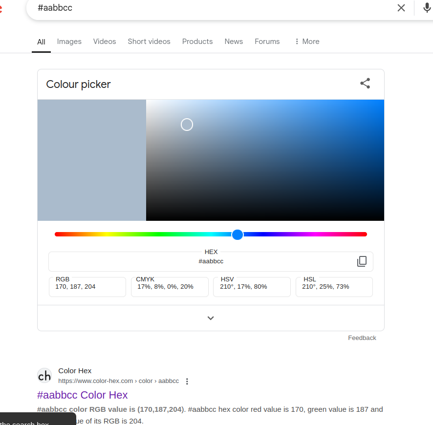
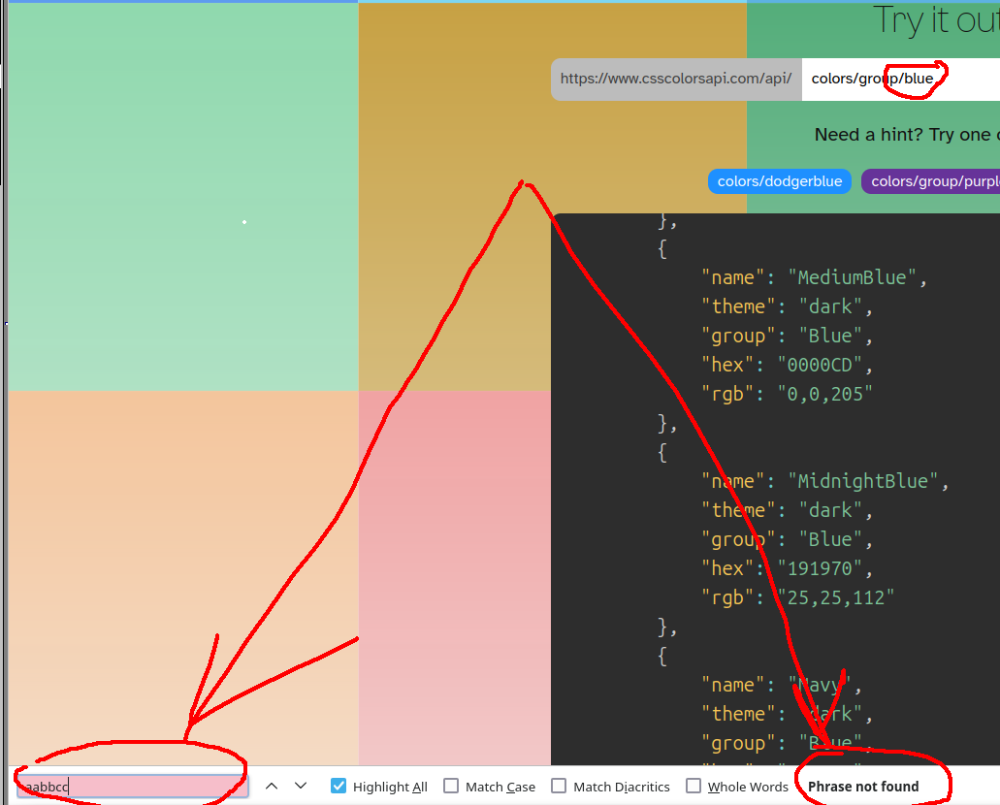

# 🎨 Brightest HEX Color Selector

A Python project that selects the **brightest color** from a list of **HEX color values** and outputs its RGB components along with its color name (optional).  
The project demonstrates principles of **object-oriented design** and mastery of the **standard Python APIs**.

---

## 📋 Task Description

 Hexadecimal color values are used for color values in frontend programming.  
  
 I.e. the RGB components are coded as hexadecimal values in the interval from 00 to FF, where FF corresponds to the decimal number 255  
 (F = 15, FF = 15 * 16 + 15 * 1 = 240 + 15 = 255).  
  
 In this representation, the color **white** is coded as `#FFFFFF`, the color **black** is coded as `#000000`, and **red** is coded as `#FF0000`.  
  
 The **brightness** of a color is determined by the formula:  
  
 ```
 sqrt(0.241 * R^2 + 0.691 * G^2 + 0.068 * B^2)
 ```  
  
 Your task is to **select the brightest color** from a list of color values and output the red, green and blue components individually.  
 Demonstrate that you can use principles of **object-oriented design** in a meaningful way, as well as master the standard Python APIs.  
  
 ### ✅ Example input:  
 ```python
 list = ["#AABBCC", "#154331", "#A0B1C2", "#000000", "#FFFFFF"]
 ```  
  
 ### ✅ Example output:  
 ```
 The brightest color is: #FFFFFF (r=255, g=255, b=255)
 ```  
  
 As a bonus (if you have some time left and/or some extra motivation):  
 - Enhance the output by the **name** of the brightest color.  
 - To solve this task, please use the API posted at https://www.csscolorsapi.com/ in your Python source code and implement an algorithm to find the most suitable color name.  


---

## 🏗️ Project Structure

    .
    ├── color_model.py  # Core classes for color representation and factory
    ├── utils.py        # utility functions and custom exceptions 
    ├── main.py         # main program logic (entry point)
    ├── .env            # some env vars
    ├── README.md
    ├── .gitignore
    └── tests/ 
        └── test_color_model.py     # Unit tests for core functionality

## 🚀 How to Run the Project

1. ✅ **Clone the repository**  
   ```bash
   git clone https://github.com/yourusername/brightest-color-selector.git
   cd brightest-color-selector
   ```

2. ✅ **Run tests**  
   ``` 
   python -m unittest tests/test_color_model.py
   ```
2. ✅ **Run main script**  
   ``` 
   pyton main.py
   ```

## 🔧 Key Features & Concepts

- Object-Oriented Design (OOP) with abstraction, polymorphism and incapsulation for ease of further scaling

- Validation and error/exception handling

## 🛠️ Problems / Things to improve

There are some problems with API of www.csscolorsapi.com. First of all it doesn't handle some unique color shades and can't handle them:

Existing Blue shade #aabbcc


But in css colors: 




Also, sometimes it returns hex colors in different cases, but it's handable


For further development http session can be integrated